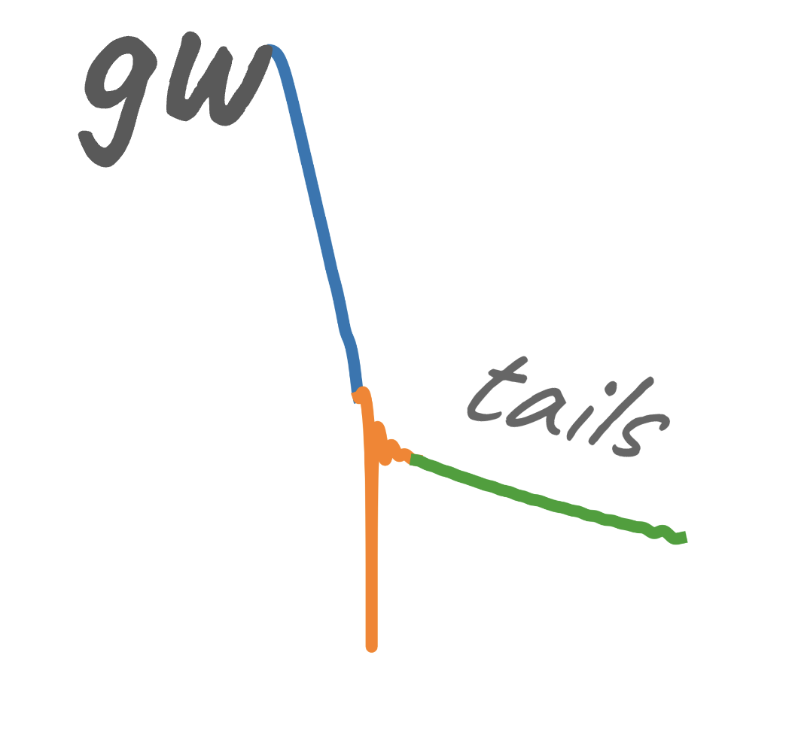

# ```gwtails```
[](https://arxiv.org/abs/2407.04682)


This is a Python package to analyze post-merger late-time tails in eccentric binary black hole (BBH) mergers. 

This code is based on the paper "Phenomenology and origin of late-time tails in eccentric binary black hole mergers" (https://arxiv.org/abs/2407.04682) by Islam, Faggioli, Khanna, Field, van de Meent and Buonanno. Here, we inspect waveforms produced by merging eccentric binary black holes (BBH). These waveforms are all generated using black hole perturbation theory. The trajectories are described by the dynamics of the point-particle orbiting the Kerr black hole using effective-one-body formalism: http://arxiv.org/abs/gr-qc/9811091, http://arxiv.org/abs/gr-qc/0001013, http://arxiv.org/abs/2405.19006. These trajectories are then fed into the time-domain Teukolsky solver developed by Gaurav Khanna and collaborators: http://arxiv.org/abs/gr-qc/0703028, http://arxiv.org/abs/0803.0317, http://arxiv.org/abs/0803.0317, http://arxiv.org/abs/1003.0485, http://arxiv.org/abs/1108.1816, http://arxiv.org/abs/arXiv:2010.04760.

## Getting the package
The latest development version will always be available from the project git repository:
```bash
git clone https://github.com/tousifislam/gwtails
```
## Issue tracker
Known bugs are recorded in the project bug tracker:
https://github.com/tousifislam/gwtails/issues

## License
This code is distributed under the MIT License. Details can be found in the LICENSE file.

## Maintainer
Tousif Islam

## Citation guideline
If you make use of the gwtails framework, please cite the following two papers:

```
@article{Islam:2024rhm,
    author = "Islam, Tousif and Faggioli, Guglielmo and Khanna, Gaurav and Field, Scott and van de Meent,  Maarten and Buonanno, Alessandra",
    title = "{Phenomenology and origin of late-time tails in eccentric binary black hole mergers}",
    eprint = "2407.04682",
    archivePrefix = "arXiv",
    primaryClass = "gw-qc",
    month = "7",
    year = "2024"
}
```

```
@article{Islam:2025wci,
    author = "Islam, Tousif and Faggioli, Guglielmo and Khanna, Gaurav",
    title = "{Bayesian analysis of late-time tails in spin-aligned eccentric binary black hole mergers}",
    eprint = "2511.21898",
    archivePrefix = "arXiv",
    primaryClass = "gr-qc",
    month = "11",
    year = "2025"
}
```

## Papers that have used ```gwtails``` in their analysis
3. 'Gravitational waves from the late inspiral, transition, and plunge of small-mass-ratio eccentric binaries'; Devin R. Becker, Scott A. Hughes, Gaurav Khanna; https://arxiv.org/abs/2511.21897
2. 'Bayesian analysis of late-time tails in spin-aligned eccentric binary black hole mergers'; Tousif Islam, Guglielmo Faggioli, Gaurav Khanna; https://arxiv.org/abs/2511.21898
1. 'Phenomenology and origin of late-time tails in eccentric binary black hole mergers'; Tousif Islam, Guglielmo Faggioli, Gaurav Khanna, Scott E. Field, Maarten van de Meent, Alessandra Buonanno; https://arxiv.org/abs/2407.04682
